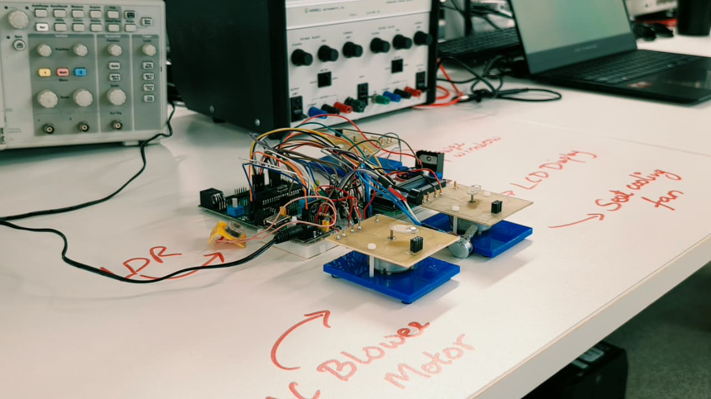
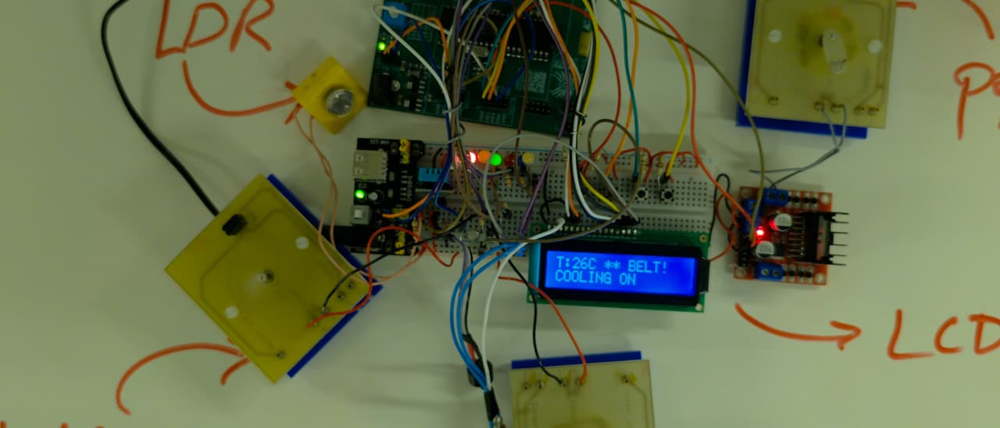
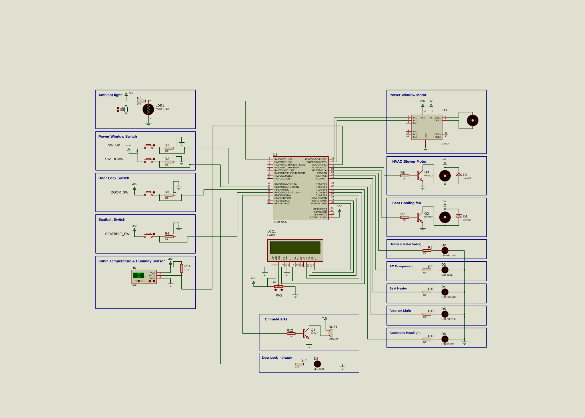

# PIC18F45K20 Automotive Comfort ECU

> An embedded automotive Comfort ECU integrating multiple vehicle comfort and convenience functions using the PIC18F45K20 microcontroller.

## Project Preview

### Physical Prototype



### Key Functions

Power Windows • HVAC • Seat Heating/Cooling • Automatic Lighting • Door Monitoring • Seatbelt Warning • LCD Status Display

### Live Demonstration



### Circuit Schematic




## Project Overview

This project presents an embedded automotive **Comfort Electronic Control Unit (ECU)** developed using the **PIC18F45K20 microcontroller**.

The ECU integrates multiple vehicle comfort and convenience functions into a single embedded controller. The system monitors switches and sensors, processes the input information, and controls corresponding vehicle functions such as power windows, climate control, seat temperature functions, interior lighting, automatic headlights, door status indication, seatbelt alerts, and an LCD status display.

The system was developed in **Embedded C using MPLAB X and XC8** and simulated using **Proteus**.

---

## Key Features

The Comfort ECU implements the following functions:

* Power window control
* HVAC heating and cooling control
* Seat heating and cooling
* Automatic ambient lighting
* Automatic headlight control
* Door status monitoring
* Seatbelt warning system
* Temperature and humidity monitoring using DHT11
* 16×2 LCD system-status display
* Buzzer-based seatbelt alert
* DC motor control using the L293D motor driver
* ADC-based ambient-light sensing using an LDR

---

## System Architecture

The PIC18F45K20 acts as the central controller.

### Inputs

* **LDR** — ambient-light sensing through the ADC
* **Window UP switch**
* **Window DOWN switch**
* **Door switch**
* **Seatbelt switch**
* **DHT11** — temperature and humidity sensing

### Outputs

* **L293D** — power-window motor control
* **HVAC blower motor**
* **Seat cooling fan**
* **Heater valve indicator**
* **AC compressor indicator**
* **Seat heater indicator**
* **Ambient light**
* **Automatic headlight**
* **Door-lock indicator**
* **Buzzer**
* **16×2 LCD**

The firmware defines the complete I/O mapping between the PIC18F45K20 and these sensors and actuators.

---

## Hardware

### Main Components

| Component     | Function                                |
| ------------- | --------------------------------------- |
| PIC18F45K20   | Main ECU microcontroller                |
| DHT11         | Temperature and humidity sensing        |
| LDR           | Ambient-light sensing                   |
| L293D         | Power-window motor driver               |
| 16×2 LCD      | System information display              |
| DC Motor      | Power-window actuator                   |
| PN2222        | Motor switching                         |
| BC547         | Buzzer switching                        |
| LEDs          | Status indication                       |
| Push switches | User/vehicle inputs                     |
| Resistors     | Pull-down, pull-up and current limiting |

---

## Pin Configuration

### Inputs

| PIC Pin   | Function                      |
| --------- | ----------------------------- |
| RA0 / AN0 | LDR / Ambient-light ADC input |
| RB0       | Window UP switch              |
| RB1       | Window DOWN switch            |
| RB2       | Door switch                   |
| RB3       | Seatbelt switch               |
| RC2       | DHT11 data                    |

### Outputs

| PIC Pin | Function            |
| ------- | ------------------- |
| RB4     | Buzzer              |
| RB5     | Door-lock indicator |
| RC0     | L293D IN1           |
| RC1     | L293D IN2           |
| RC3     | HVAC blower         |
| RC4     | Seat cooling fan    |
| RC5     | Heater valve        |
| RC6     | AC compressor       |
| RC7     | Seat heater         |
| RD0     | Ambient light       |
| RD1     | Automatic headlight |
| RD2     | LCD RS              |
| RD3     | LCD Enable          |
| RD4–RD7 | LCD D4–D7           |

The pin mapping above is taken from the final firmware configuration.

---

## Control Functions

### 1. Power Window Control

Two switches control the direction of the power-window motor.

* Window UP → L293D IN1 = HIGH, IN2 = LOW
* Window DOWN → L293D IN1 = LOW, IN2 = HIGH
* No switch input → Motor stopped

The firmware implements these states in `Control_Windows()`.

### 2. Climate Control

The HVAC system uses temperature feedback from the DHT11.

#### Heating

Heating is activated below **10°C** and remains active until the temperature reaches **20°C**.

Heating mode activates:

* Heater valve
* HVAC blower
* Seat heater

#### Cooling

Cooling is activated above **25°C** and remains active until the temperature drops to **18°C**.

Cooling mode activates:

* AC compressor
* HVAC blower
* Seat cooling fan

The control system uses separate ON/OFF thresholds to provide hysteresis.

## 3. Automatic Lighting

The LDR is connected to the PIC18F45K20 ADC through a voltage-divider circuit.

The firmware uses two thresholds:

* **ADC > 800** → Ambient light ON
* **ADC > 600** → Automatic headlight ON

The lighting logic is implemented through the ADC reading from AN0.

## 4. Door Status

The door switch is monitored through RB2.

* Door open → Door indicator ON
* Door closed → Door indicator OFF

The door status is also displayed on the LCD.

---

## 5. Seatbelt Warning

The seatbelt switch is monitored through RB3.

When the seatbelt is not fastened:

* The buzzer generates an alternating alert pattern.
* A seatbelt warning is displayed on the LCD.

When the seatbelt is fastened, the buzzer is switched OFF.

---

## 6. LCD Display

A 16×2 LCD operates in **4-bit mode**.

The first line continuously displays temperature and humidity information.

The second line rotates through:

1. Climate status
2. Door status
3. Lighting status
4. Seatbelt status

Each status is displayed for approximately **2 seconds** before the next status is shown.

---

## Circuit Schematic

The complete Proteus circuit is shown below.


The schematic shows the PIC18F45K20 connected to the sensors, switches, LCD, motor driver, actuators and status indicators.

---

## Software

### Development Environment

* **Microcontroller:** PIC18F45K20
* **Programming Language:** Embedded C
* **IDE:** MPLAB X
* **Compiler:** MPLAB XC8 v2.x
* **Simulation:** Proteus
* **Clock Frequency:** 20 MHz

The firmware uses a 20 MHz external oscillator configuration.

---

## Firmware Structure

The firmware is organised into functional control sections:

```text
main.c
│
├── Configuration bits
├── Pin definitions
├── LCD driver
├── ADC driver
├── DHT11 driver
├── Power window control
├── Climate control
├── Lighting control
├── Door status control
├── Seatbelt warning
├── LCD status display
└── Main control loop
```

The main loop continuously reads the sensors, executes the individual control functions, updates the LCD, and maintains the timing of the ECU functions.

---

## Proteus Simulation

The Proteus simulation is provided in the `Proteus` folder, while the compiled firmware HEX file is provided in the `Firmware` folder.

### Running the Simulation

1. Open the Proteus project:

   `Proteus/Comfort ECU Design Ver 3.0.pdsprj`

2. Open the **PIC18F45K20** microcontroller properties.

3. Set the **Program File** to:

   `Firmware/Comfort_ECU.production.hex`

4. Confirm the microcontroller clock configuration.

5. Start the Proteus simulation.

6. Operate the switches and sensor inputs to observe the corresponding ECU outputs.

### Firmware

The repository contains both the source code and compiled firmware:

```text
Firmware/
├── main.c
└── Comfort_ECU.production.hex
```
---

## Repository Structure

```text
PIC18F45K20-Comfort-ECU/
│
├── Documentation/
│   ├── Comfort ECU Design.SVG
│   └── Comfort_ECU_Schematic.png
│
├── Firmware/
│   └── main.c
│
├── Proteus/
│   └── Comfort ECU Design Ver 3.0.pdsprj
│
├── .gitattributes
└── README.md
```

---

## Future Improvements

Potential future development could include:

* CAN/CAN-FD communication between multiple ECUs
* Automotive diagnostic functionality
* Fault detection and fault-code logging
* More advanced HVAC control
* PWM-based actuator control
* Real-time monitoring and diagnostics
* Hardware PCB implementation
* Integration with additional automotive sensors

---

## Project Status

**Version:** Final Version 3.0

**Status:** Completed

The current repository contains the embedded firmware, Proteus simulation project, and circuit schematic for the Comfort ECU.

---

## License

This project is provided for educational and portfolio purposes.
